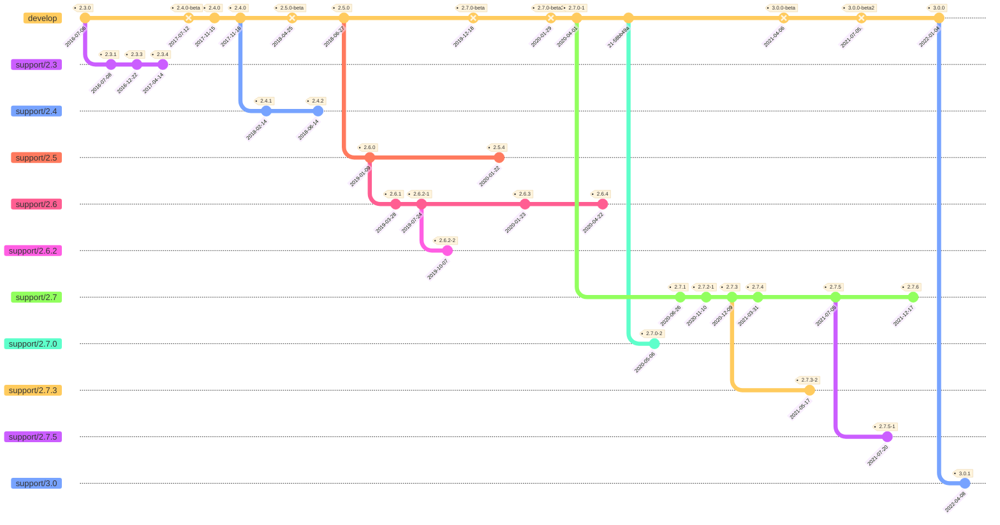

This is a test to see if we can use Mermaid to create a graph representing iTop verions.

Useful links :
- Mermaid reference : https://mermaid-js.github.io/mermaid/#/
- GitHub support : https://github.blog/2022-02-14-include-diagrams-markdown-files-mermaid/




Nice Excel formula to get the commit text :
```excel
=CONCATENER("commit id: """;TEXT(A52,"yyyy-mm-dd");""" tag: """;C52;"""");
```