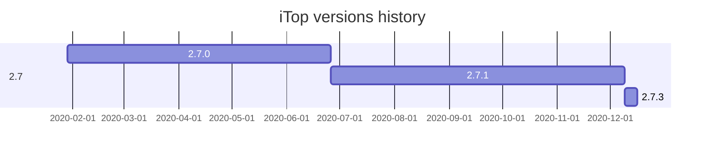

* Gantt reference : https://mermaid-js.github.io/mermaid/#/./gantt
* ➕ Benefits
  - vertical bars, easier to see versions per year
* ➖ Drawbacks
  - task duration is mandatory, cannot say "until child start"
  - hard to see hierarchy/graph

